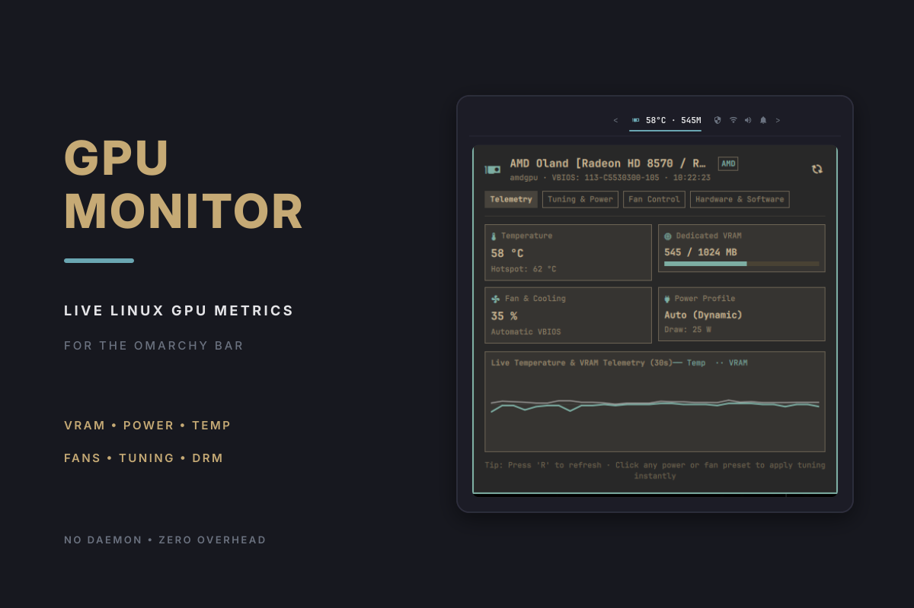
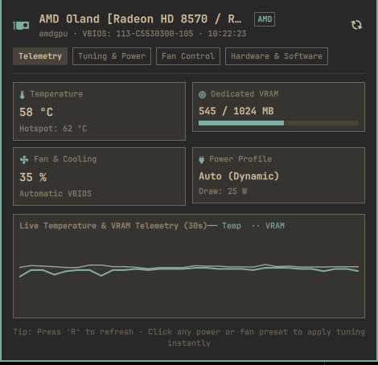
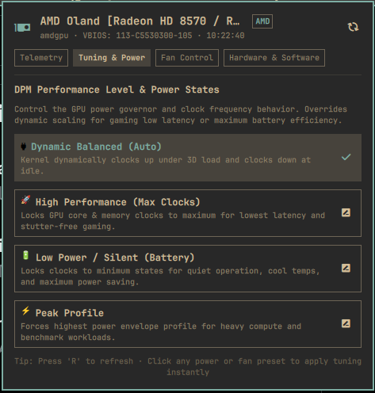
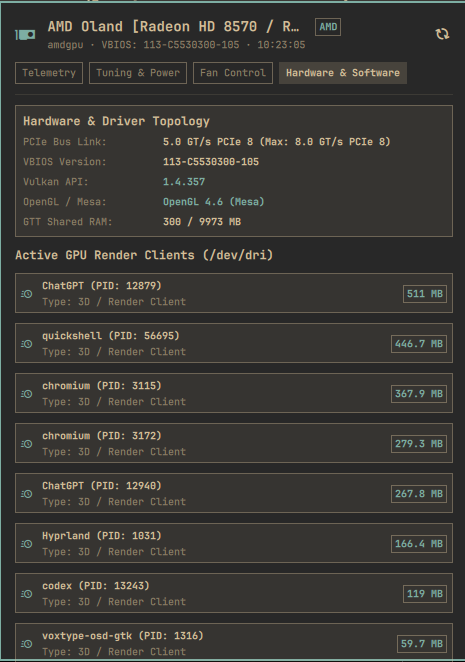

# OmaGPU for Omarchy

[](https://omarchy.org/manual/shell-plugins/)
[](https://github.com/ucmz851/omagpu)
[](LICENSE)

An advanced hardware telemetry dashboard, DPM power governor tuner, acoustic fan controller, and graphics stack monitor built natively for the **Omarchy Quattro bar** (inspired by LACT).



<p align="center"><sub>Built from a live Omarchy capture; hardware telemetry sampled directly from Linux DRM and sysfs.</sub></p>

## Highlights

- **🎨 Multi-State Dynamic Colors:** Bar and panel icons dynamically change colors based on active power governors, fan acoustic speeds, and thermal levels.
- **⚡ DPM Power & Clock Tuning:** Switch between dynamic **Auto**, **High Performance** (locked max clocks for low latency gaming), **Low Power / Silent** (battery saving), and **Peak Profile**.
- **🌡️ Multi-Sensor Thermals:** Real-time Core Temperature (°C) and Hotspot / Junction Temperature (°C) with dynamic thermal warning states.
- **💾 VRAM & GTT Memory Breakdown:** Live dedicated VRAM capacity progress bar and GTT system-shared memory allocations.
- **💨 Acoustics & Fan PWM Tuning:** Switch between automatic VBIOS firmware curves and manual fixed PWM presets (`35% Silent`, `60% Balanced`, `80% Aggressive`, `100% Max`).
- **📈 Rolling Telemetry Sparklines:** Built-in 30-second live historical graph tracking temperature and VRAM spikes in real time.
- **🧩 Graphics Stack & Topology:** Reports GPU Model, ASIC Family, VBIOS version, PCIe Link Speed/Width, Resizable BAR, Vulkan 1.3/1.4 instance versions, and Mesa/OpenGL versions.
- **🔍 Active GPU Process Monitor:** Identifies live processes utilizing the `/dev/dri` render node (e.g. Hyprland, Chromium, Games) with dedicated RSS memory allocations.
- **🖥️ Multi-GPU Selection:** Detects every NVIDIA adapter independently, matches DRM devices by PCI bus ID, and lets you switch live telemetry from the panel header.

## Screenshots

<p align="center">
  
  &nbsp;&nbsp;
  
  &nbsp;&nbsp;
  
</p>

## Dynamic Status & Icon Colors

The bar icon and panel telemetry gauges dynamically transition colors based on the GPU's operational state:

| State Indicator | Color | Trigger Condition |
| :--- | :--- | :--- |
| **🟢 Eco / Silent** | Soft Green (`#87c095`) | `Low Power / Silent` or `Power Saving` DPM governor active. |
| **🔵 Balanced Auto** | Cyan / Foreground (`#6aa6b2`) | Normal `Dynamic Auto` mode with stable thermals (<68°C) and moderate fan speeds. |
| **🟡 High Performance / Warm** | Gold / Accent (`Color.accent`) | `High Performance`, `3D Gaming`, `Peak Profile`, Temp ≥ 68°C, or Fan PWM ≥ 60%. |
| **🔴 Critical / Extreme Cooling** | Urgent Red (`Color.urgent`) | Thermal threshold ≥ 80°C, Fan PWM ≥ 85%, or Dedicated VRAM capacity ≥ 92%. |

## Multi-Vendor Hardware Support

| Vendor | Driver / Interface | Telemetry & Controls Supported |
| :--- | :--- | :--- |
| **AMD** | `amdgpu` (DRM sysfs & hwmon) | GPU %, VRAM / GTT, Core & Hotspot Temp, Fan PWM, DPM Power States, Power Cap. |
| **NVIDIA** | `nvidia` (NVML / nvidia-smi) | GPU %, VRAM, Core & Hotspot Temp, Fan Speed, Power Draw (Watts), Clock Frequencies. |
| **Intel** | `i915` / `xe` (DRM sysfs) | Frequency Scaling (RP0/RPe/RPn), RC6 Power States, Package Temp, Arc Dedicated/Shared VRAM. |

## Install

OmaGPU requires Omarchy with shell plugin support.

```sh
omarchy plugin add https://github.com/ucmz851/omagpu.git --enable
```

The shell normally picks up the plugin immediately. If the widget does not appear, restart it once:

```sh
omarchy restart shell
```

## Use

| Action | Result |
| --- | --- |
| **Left-click** | Open or close the GPU control center |
| **Middle-click** | Refresh telemetry metrics immediately |
| **`R` while open** | Refresh telemetry metrics now |
| **`[` / `]` while open** | Switch to the previous or next GPU |
| **`Esc` while open** | Close panel |
| **`Tab` / `Shift+Tab`** | Switch between panels in sequence |

## Hardware Metrics & Sysfs Sources

| Subsystem | Kernel Source / Interface |
| --- | --- |
| **GPU Model & Topology** | `/sys/class/drm/card*/device/vendor`, `device`, `subsystem_device`, `lspci` |
| **Thermals & Hotspot** | `/sys/class/drm/card*/device/hwmon/hwmon*/temp1_input`, `temp2_input` |
| **VRAM & GTT Memory** | `/sys/class/drm/card*/device/mem_info_vram_*`, `mem_info_gtt_*` |
| **Fan RPM & PWM** | `/sys/class/drm/card*/device/hwmon/hwmon*/fan1_input`, `pwm1` |
| **Power Consumption** | `/sys/class/drm/card*/device/hwmon/hwmon*/power1_average`, `power1_input` |
| **PCIe Bus Link** | `/sys/class/drm/card*/device/current_link_speed`, `current_link_width` |
| **Render Client Processes** | `/dev/dri/renderD*` active file descriptor clients via `/proc/*/` |
| **NVIDIA Graphics** | `nvidia-smi` / NVML query interface |

## Power Governors & Tuning

| Profile Mode | Kernel Value | Target Behavior |
| --- | --- | --- |
| **Dynamic Auto** | `auto` | Balanced dynamic scaling. Clocks down to minimum at idle, clocks up under 3D load. |
| **High Performance** | `high` | Locks core and memory clocks to maximum states for stutter-free gaming and low frame latency. |
| **Low Power / Silent** | `low` | Locks clocks to lowest P-states for silent fan operation and battery saving. |
| **Peak Profile** | `profile_peak` | Forces highest power envelope for compute and heavy rendering. |

## Security & Privilege Model

* **Telemetry Sampling:** 100% unprivileged. All GPU metrics, temperatures, VRAM, and process lists are read directly through standard unprivileged kernel sysfs and `/proc/` nodes with zero root requirements.
* **Tuning Controls:** Applying fan speed overrides or DPM power governor changes prompts through standard desktop PolicyKit (`pkexec`) authentication to safely guard hardware configuration changes.

## Update

```sh
omarchy plugin update ucmz851.omagpu --yes
```

## Remove

```sh
omarchy plugin remove ucmz851.omagpu
```

Removing the plugin unregisters the widget from your bar and removes its checkout. It does not alter system graphics packages.

## Privacy & Security

All telemetry inspection stays 100% on-device. The plugin does not connect to external networks, collect credentials, or transmit telemetry. All UI text rendering explicitly enforces `textFormat: Text.PlainText` to prevent rich-text parsing.

## Development

Validate the plugin schema from a checkout:

```sh
omarchy plugin validate .
```

Run the engine regression tests (live multi-GPU verification is enabled automatically on supported NVIDIA systems):

```sh
python -m unittest discover -s tests -v
```

## License

[MIT](LICENSE) © 2026 Usama Imran (ucmz851).
